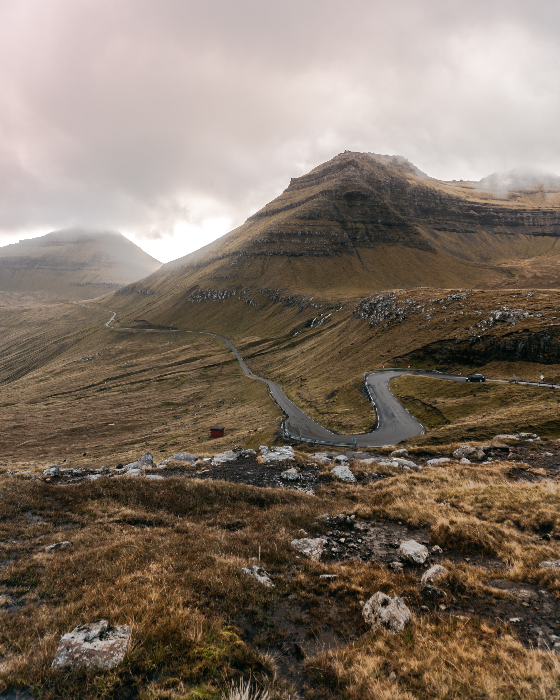

---
# Feel free to add content and custom Front Matter to this file.
# To modify the layout, see https://jekyllrb.com/docs/themes/#overriding-theme-defaults

layout: default
title: Home
permalink: /
---

From Buenos Aires, Argentina. Previous work related to engineering and research on computational models, structural dynamics, machine learning and statistics. Currently working on statistics and predictive models, studying how to increase the learning rate of living beings.

## Latest activities:


    {{ post.date | date: "%B %-d, %Y"  }}  
    <a href="{{ post.url }}" style="font-size:28px; text-decoration: none; color:#547DE8">{{ post.title }} </a>


<a href="/blog">See more</a>

<!--    
Photo by <a href="https://unsplash.com/@p_kuzovkova?utm_source=unsplash&amp;utm_medium=referral&amp;utm_content=creditCopyText">Polina Kuzovkova</a> on <a href="https://unsplash.com/t/nature?utm_source=unsplash&amp;utm_medium=referral&amp;utm_content=creditCopyText">Unsplash</a>-->

